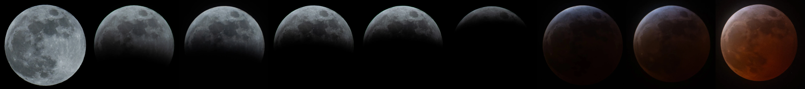

+++
title = 'Crimson Macaron'
date = 2025-08-08T20:00:00+08:00
draft = false
tags = ['photos', 'moon', 'astronomy']
cover = 'cover.webp'
description = 'The beautiful blood Moon captured on 13 March 2025'
+++

On 13 March 2025, a total lunar eclipse occurred, which can be viewed in
North America. This rare celestial event was a spectacular sight to behold.
The bright section of the moon gradually dimmed and turned a deep red color,
earning it the nickname "Blood Moon".

<!-- more -->

The pictures are all captured with my Sony ILCE-7M4 camera and Sigma 100-400mm
F/5-6.3 DG DN OS lens, all taken in Seattle, Washington, USA.

## The Pre-eclipse Full Moon

")

## The Eclipse Process

### Pictures of the Process

")

")

")

")

")

")

")

### The Crimson Macaron (Blood Moon)

")

")
